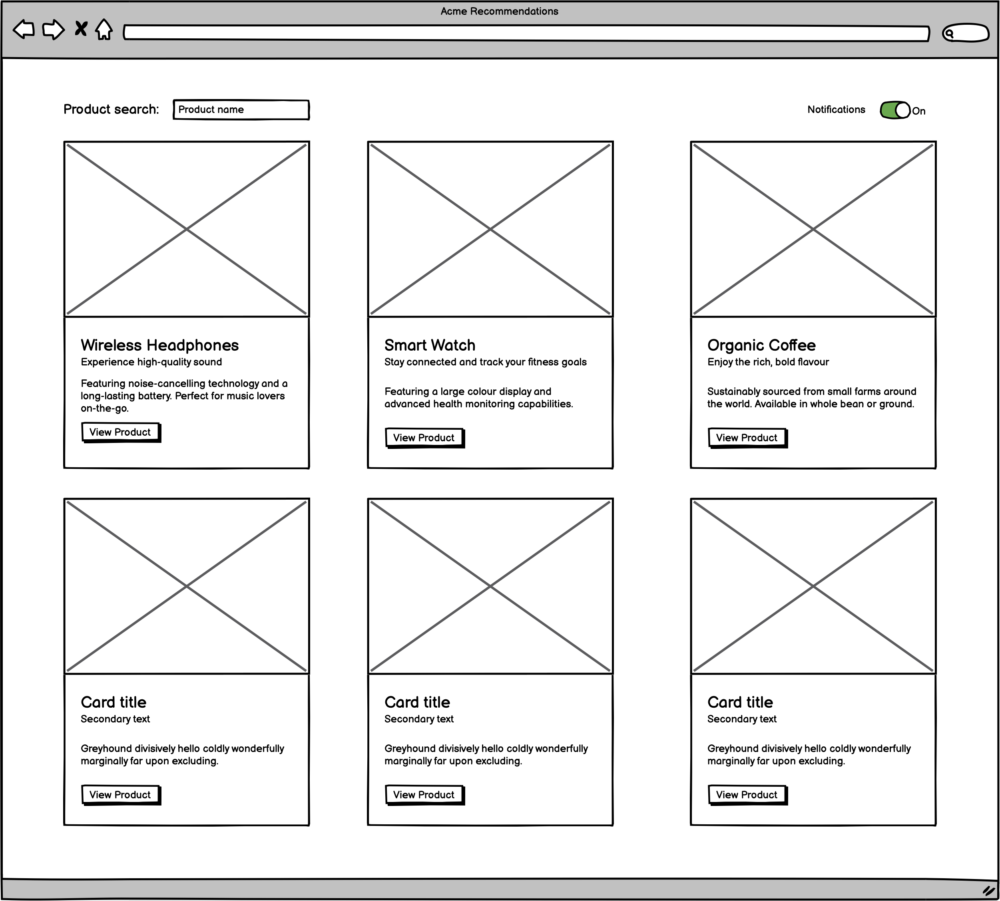
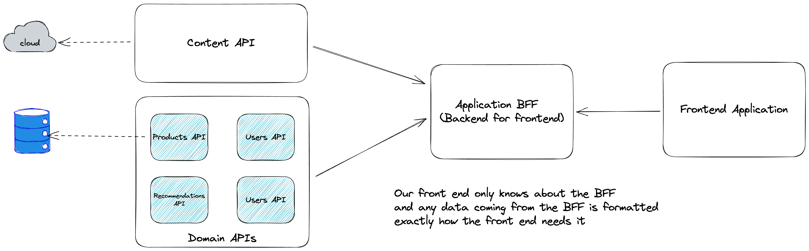

# React Component-Driven Development & DOM Testing Monorepo

Welcome to the React Component-Driven Development & DOM Testing Monorepo! This repository contains all the code and examples for a comprehensive talk on building React applications using Test-Driven Development (TDD) and DOM testing. [Here is a link to the talk itself.](https://www.youtube.com/watch?v=jBkEz-Azsak) The monorepo has been organized using PNPM and Turborepo to streamline package management and build processes.

If you are not familiar with the concept of a monorepo, it is a single repository that contains multiple projects. In this case, the monorepo contains a shared UI library, and a couple of React applications. The shared UI library contains reusable and accessible React components, along with their tests and stories. The React application demonstrates component usage and integration. The Next.js application demonstrates the power of composition in React with the Mantine UI library's Modal component.

[You can read more about monorepos here](https://monorepo.tools/).

## Overview

The primary goal of this monorepo is to demonstrate best practices for building reusable and accessible React components, and how to effectively test them using tools like React Testing Library and Storybook. Additionally, it showcases the use of Mock Service Worker to handle external dependencies in tests and illustrates the Backend-for-Frontend (BFF) pattern in action. The talk is tailored for an audience with a mix of front-end and back-end experience, emphasizing the power of composition in React and how it applies to both component development and testing.

Ultimately, we see how we can build and test this interface:



## Contents

The monorepo is structured as follows:

### Apps

- `frontend`: A React application built using Create React App to demonstrate component usage and integration.
- `mantine-example`: A Next.js application demonstrating the power of composition in React with the Mantine UI library's Modal component. This app is used as an introduction to the talk, highlighting the benefits of composition when building and testing React components.

### Packages

- `ui`: An example of a shared UI library containing reusable and accessible React components, along with their tests and stories.
- `types`: A shared library containing TypeScript types used by the other packages.
- `mocks`: A shared library containing mock data used by the other packages.

## Getting Started

You will need to [install pnpm globally](https://pnpm.io/installation) to run the monorepo.

The version of pnpm used when developing this monorepo is `8.2.0`, and node version `18.16.0`.

The version of storybook installed has issues when running previous versions of node. Please use at least node version `18.16.0`.

To install the dependencies for the monorepo, run the following command:

```bash
pnpm install
pnpm build
```

The monorepo can be run using the following commands:

- `pnpm run dev`: Runs the monorepo in development mode.
- `pnpm run build`: Builds the monorepo for production.
- `pnpm run start`: Runs the monorepo in production mode.
- `pnpm run test`: Runs the monorepo tests.

To run storybook, run the following command:

```bash
pnpm run storybook
```

## Running tests

You can either run all the tests for the repo or run tests for a specific package.

To run all the tests, run the following command:

```bash
pnpm run test
```

To run tests for a specific package, cd into the directory and run the following command:

```bash
pn test -- --watch
```

To run the application tests, run the following command:

```bash
cd apps/frontend
pnpm run test -- --watch
```

To run the component tests, run the following command:

```bash
cd packages/ui
pnpm run test -- --watch
```

I hope you find this monorepo useful in understanding the best practices for React Component-Driven Development and DOM testing. Feel free to explore the code, run the examples, and contribute to the repository. Happy coding!

## Extra notes

A suggested API architecture for a modern front end is the Backend for frontend pattern:



You can read more about it [here](https://samnewman.io/patterns/architectural/bff/).
