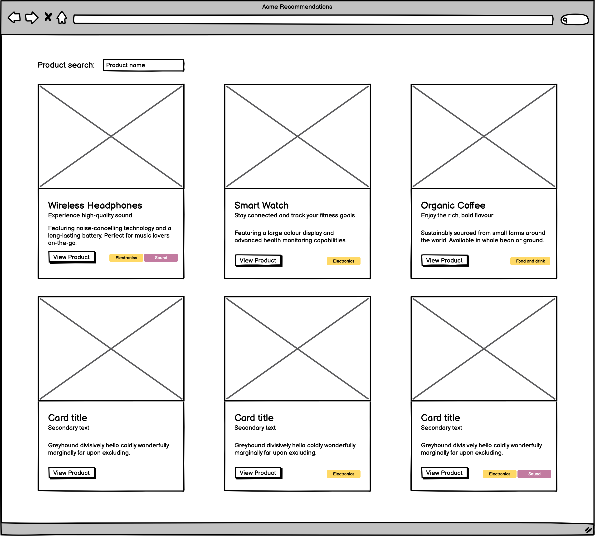
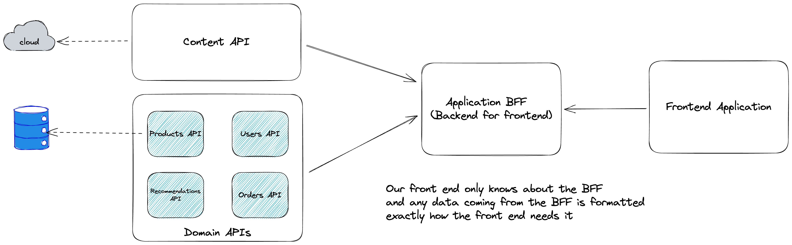

# React Component-Driven Development & DOM Testing Monorepo

Welcome to the React Component-Driven Development & DOM Testing Monorepo! This repository contains all the code and examples for a comprehensive talk on building React applications using Test-Driven Development (TDD) and DOM testing. [Here is a link to the talk itself.](https://www.youtube.com/watch?v=jBkEz-Azsak) The monorepo has been organized using PNPM and Turborepo to streamline package management and build processes.

If you are not familiar with the concept of a monorepo, it is a single repository that contains multiple projects. In this case, the monorepo contains a shared UI library, and a couple of React applications. The shared UI library contains reusable and accessible React components, along with their tests and stories. The React application demonstrates component usage and integration. The Next.js application demonstrates the power of composition in React with the Mantine UI library's Modal component.

[You can read more about monorepos here](https://monorepo.tools/).

## Overview

The primary goal of this monorepo is to demonstrate best practices for building reusable and accessible React components, and how to effectively test them using tools like React Testing Library and Storybook. Additionally, it showcases the use of Mock Service Worker to handle external dependencies in tests and illustrates the Backend-for-Frontend (BFF) pattern in action. The talk is tailored for an audience with a mix of front-end and back-end experience, emphasizing the power of composition in React and how it applies to both component development and testing.

Ultimately, we see how we can build and test this interface:



## Contents

The monorepo is structured as follows:

### Apps

- `frontend`: A React application built using Create React App to demonstrate component usage and integration.
- `mantine-example`: A Next.js application demonstrating the power of composition in React with the Mantine UI library's Modal component. This app is used as an introduction to the talk, highlighting the benefits of composition when building and testing React components.

### Packages

- `ui`: An example of a shared UI library containing reusable and accessible React components, along with their tests and stories.
- `types`: A shared library containing TypeScript types used by the other packages.
- `mocks`: A shared library containing mock data used by the other packages.

## Getting Started

You will need to [install pnpm globally](https://pnpm.io/installation) to run the monorepo.

The version of pnpm used when developing this monorepo is `8.2.0`, and node version `18.16.0`.

The version of storybook installed has issues when running previous versions of node. Please use at least node version `18.16.0`.

To install the dependencies for the monorepo, run the following command:

```bash
pnpm install
pnpm build
```

The monorepo can be run using the following commands:

- `pnpm run dev`: Runs the monorepo in development mode.
- `pnpm run build`: Builds the monorepo for production.
- `pnpm run start`: Runs the monorepo in production mode.
- `pnpm run test`: Runs the monorepo tests.

To run storybook, run the following command:

```bash
pnpm run storybook
```

## Running tests

You can either run all the tests for the repo or run tests for a specific package.

To run all the tests, run the following command:

```bash
pnpm run test
```

To run tests for a specific package, cd into the directory and run the following command:

```bash
pn test -- --watch
```

To run the application tests, run the following command:

```bash
cd apps/frontend
pnpm run test -- --watch
```

To run the component tests, run the following command:

```bash
cd packages/ui
pnpm run test -- --watch
```

I hope you find this monorepo useful in understanding the best practices for React Component-Driven Development and DOM testing. Feel free to explore the code, run the examples, and contribute to the repository. Happy coding!

## Extra notes

A suggested API architecture for a modern front end is the Backend for frontend pattern:



You can read more about it [here](https://samnewman.io/patterns/architectural/bff/).

## AI Generated Notes for the talk

Here's a summary and key takeaways from the presentation:

SUMMARY:
Paul Hammond, director at [Pack software](https://packsoftware.co.uk/), presents on component-driven development with React and DOM testing, covering topics like test-driven development, accessibility, and modern front-end practices.

IDEAS:

- Component-driven development helps build reusable, consistent UI elements
- Testing against behavior rather than implementation details provides more value
- Accessibility should be a key consideration when building front-end components
- Tools like Storybook allow interactive development and documentation of components
- Mock Service Worker enables mocking API calls for both testing and development
- Backend for Frontend (BFF) pattern can simplify front-end architecture
- Good tests give confidence to make changes over time
- React Testing Library encourages testing from a user's perspective
- TDD can lead to more maintainable and flexible code
- Composable components allow for easier customization and reuse

INSIGHTS:

- Testing behavior instead of implementation allows for easier refactoring and maintenance
- Accessible selectors in tests can improve overall application accessibility
- Component explorers like Storybook facilitate collaboration between designers and developers
- Mocking at the network level allows for consistent mocks across tests and development
- TDD can lead to faster feedback loops and higher confidence in code changes
- Focusing on delivery outcomes can help convince teams to adopt TDD practices
- Using the DOM for testing closely mimics real user interactions
- Separating UI concerns from business logic improves overall application architecture
- Continuous delivery practices like "walking skeletons" can improve project setup
- Balancing unit tests with integration/E2E tests covers different testing scenarios

QUOTES:

- "The purpose of good tests is to give us the confidence to make changes over time."
- "If tests are passing, we should feel confident enough to go straight to production."
- "Modern front ends are built with components and not pages."
- "Component driven development helps us to build reusable components that reduce duplication."
- "We want to see how we make changes over time, how tests help us to make changes over time."
- "Good tests should give us the confidence to make changes over time."
- "The joy of TDD is the right way of putting it because it's such a liberating experience."
- "I haven't worked late for 10 years, and because I don't need to, and you shouldn't need to if you write in a test-first style."
- "When it comes to testing, one of the things I typically do is... I would pull somebody's branch down, run the tests, deliberately fail something and see the tests."
- "I need to have confidence that's the way it works."

HABITS:

- Write tests before implementation code to ensure proper test coverage
- Use accessible selectors in tests to improve overall accessibility
- Collaborate closely with designers using tools like Storybook
- Refactor code confidently with a strong test suite in place
- Run tests in watch mode for instant feedback during development
- Use mock service workers to simulate API responses in tests
- Build walking skeletons to establish CI/CD pipelines early in projects
- Review pull requests by intentionally breaking code to verify test coverage
- Prioritize testing behavior over implementation details in front-end tests
- Continuously learn and apply best practices in front-end development

FACTS:

- React Testing Library is built on top of DOM Testing Library
- Jest uses an in-memory DOM representation called jsdom for testing
- Mock Service Worker can intercept and mock API calls at the network level
- Storybook is a tool for developing UI components in isolation
- Accessibility affects 30-40% of the population in some form
- Component-driven development is framework-agnostic and applies to React, Vue, Angular, etc.
- Test-driven development can lead to fewer bugs and more maintainable code
- The Backend for Frontend pattern can improve front-end performance and simplify architecture
- Cypress and Playwright are tools for end-to-end testing of web applications
- Mutation testing can be used to verify the quality of test suites

REFERENCES:

- React Testing Library
- Storybook
- Mock Service Worker
- Jest
- Cypress
- Playwright
- Redux Toolkit
- React Query
- Testing JavaScript (by Kent C. Dodds)
- W3C Web Accessibility Initiative (WAI)
- Ian Cooper's talk "TDD: Where Did It All Go Wrong"
- GitHub Primer (UI component library)
- Testing Library Playground
- Backend for Frontend (BFF) pattern

ONE-SENTENCE TAKEAWAY:
Test-driven development with React Testing Library enables confident, maintainable front-end code by focusing on behavior and accessibility.

RECOMMENDATIONS:

- Adopt component-driven development to improve reusability and consistency in front-end applications
- Use Storybook or similar tools to develop and document UI components
- Implement test-driven development practices for front-end code to improve quality
- Focus on testing behavior rather than implementation details for more resilient tests
- Utilize Mock Service Worker for consistent API mocking in tests and development
- Consider implementing a Backend for Frontend pattern to simplify front-end architecture
- Prioritize accessibility in component design and testing from the start
- Use React Testing Library's accessible selectors to improve overall application accessibility
- Implement continuous integration and delivery practices early in projects
- Balance unit tests with integration and end-to-end tests for comprehensive coverage
